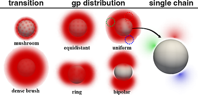

# RuSseL3D
This is the repository of the RuSseL3D code.

The code is named after the British philosopher and mathematician, Bertrand Russell.

It is an open-source code, distributed under the terms of the accompanying LICENSE.

# Authors
- Mr. Constantinos J. Revelas (cjrevelas@gmail.com)
- Dr. Aristotelis P. Sgouros (arissgouros@gmail.com)
- Dr. Apostolos T. Lakkas (tolis1981@gmail.com)
- Prof. Doros N. Theodorou (doros@central.ntua.gr, scientific advisor and mentor)

# Description
RuSseL3D is a code developed in Fortran which applies the Finite Element Method to run three-\
dimensional calculations on heterogeneous polymer systems, based on Self-Consistent Field Theory (SCFT).\
At the moment, the code can address homopolymer melts in contact with solid surfaces and provide with\
useful results regarding the thermodynamics and the structural properties of the system. The solid\
surfaces can be either bare or grafted with polymer chains of the same chemical identity as the matrix chains.\
The code will be gradually "translated" to modern C++ so that more people are potentially attracted to\
contribute in its development.

# Organization
The RuSseL3D repository includes the following files and directories:
 - README        -> the current file
 - LICENSE       -> the GNU General Public License of the code (GPL)
 - LICENSE-FHASH -> a license allowing the usage of the fhash.f90 subroutine
 - Makefile      -> file controlling the compilation process (will be replaced by CMakeLists.txt in the future)
 - .fortls       -> file for configuring the neovim fortran environment based on the fortran language server
 - .gitignore    -> contains all files and directories to be ignored by the git version control system
 - .git/         -> directory containing the settings of the git version control system
 - obj/          -> directory where all object files are dropped during the compilation process
 - run/          -> directory where the compiled executable file is redirected after compilation
 - src/          -> directory containing all the source files of the code
 - tools/        -> directory containing all the pre- and post- processing files

To configure and compile, the code type the following commands inside the root directory of the code
    make

# Future extensions
 - ability to import mesh from open-source meshers
 - block copolymer systems and polymer blends
 - incorporate incompressible models for the calculation of the free energy
 - optimize EoS model in absence of matrix chains
 - non monodisperse matrix and grafted chains
 - find faster solver for linear system of equations (maybe iterative)
 - dynamic density functional theory calculations (ddft)

# Short Description of code capabilities
Using this code, we can grafted polymer chains on solid surfaces according\
to various distributions, as shown in the image below.

